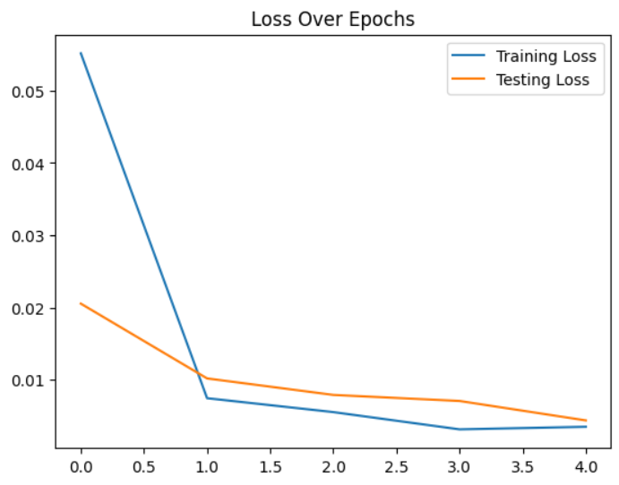
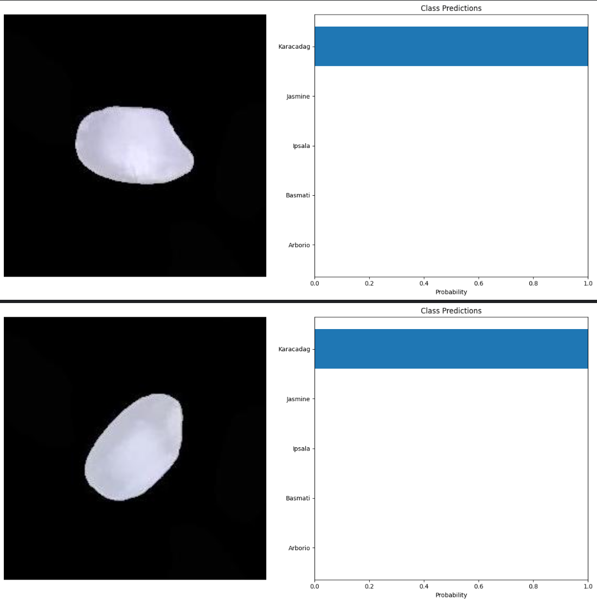

# 🌾 Rice Image Classification with PyTorch & EfficientNet

## 📋 Project Overview
This project implements an end-to-end Deep Learning pipeline to classify rice grains into 5 distinct varieties (Arborio, Basmati, Ipsala, Jasmine, Karacadag).

By leveraging **Transfer Learning** with `EfficientNet-B0`, the model achieved a test accuracy of **99.91%**. While the architectural pattern was inspired by a card classification tutorial, this project adapts that workflow to a biological dataset, requiring changes to the data loading pipeline and model tuning to distinguish between fine-grained visual features of rice.

## 🧠 Key Technical Skills Demonstrated
* **Deep Learning Architecture:** Utilized `timm` to implement **Transfer Learning**, modifying a pre-trained **EfficientNet-B0** model by replacing the classifier head.
* **PyTorch Data Pipeline:** Built a custom `RiceClassifier` Dataset class to handle the specific directory structure of the Rice Image Dataset.
* **Model Training:** Implemented a full training loop with **GPU acceleration**, `CrossEntropyLoss`, and the **Adam optimizer**.
* **AI-Assisted Development ("Vibe Coding"):** Leveraged AI tools to accelerate the development of the **Results Visualization** and evaluation logic, focusing on efficiency and rapid iteration.

## ⚙️ Methodology

### 1. Data Preparation
* **Dataset:** Rice Image Dataset (5 Classes).
* **Preprocessing:** Images were resized to `128x128` and converted to PyTorch tensors.
* **Loading:** Custom `Dataset` class inheriting from `torch.utils.data.Dataset`.

### 2. Model Architecture
I selected **EfficientNet-B0** for its balance of accuracy and computational efficiency.
* **Base:** Pre-trained on ImageNet.
* **Custom Head:** Added a `Dropout(0.5)` layer for regularization and a `Linear` layer mapping 1280 features to 5 output classes.

### 3. Training
* **Epochs:** 5
* **Batch Size:** 50
* **Optimization:** Adam (`lr=0.0001`)

## 📊 Results & Visualization
The model achieved an exceptional **99.91% accuracy** on the test set.

### Training vs. Validation Loss
*> The graph below demonstrates the model's convergence over 5 epochs, showing no signs of overfitting.*

*(Note: Replace `images/loss_curve.png` with your actual plot image file)*

### Model Predictions
*> Random samples from the test set with confidence scores.*

*(Note: Replace `images/prediction_sample.png` with your actual prediction image file)*

## 🔗 Credits & Adaptation Notes
This project was architecturally inspired by [Rob Mulla's Card Classifier tutorial](https://www.youtube.com/watch?v=tHL5STNJKag). However, this implementation represents a **domain adaptation** from object detection (cards) to biological classification (grains).

**Key Engineering Adaptations:**
* **Dataset Re-Engineering:** The data pipeline was rewritten to parse the `Rice_Image_Dataset` directory structure, which differs from the original tutorial's data format.
* **Hyperparameter Tuning:** Adjusted learning rates and batch sizes to optimize for the fine-grained texture differences between rice species.

## 🔗 Project Links

* **🚀 Live Demo:** )
* **Dataset:** [Rice Image Dataset (Kaggle)](https://www.kaggle.com/datasets/muratkokludataset/rice-image-dataset)
* **Original Inspiration:** [Rob Mulla's Card Classifier](https://www.kaggle.com/code/robikscube/train-your-first-pytorch-model-card-classifier)

---

### 💻 How to Run
1.  Clone the repository.
2.  Install dependencies: `pip install torch torchvision timm pandas numpy matplotlib tqdm`.
3.  Run the notebook `riceclassifier.ipynb`.
